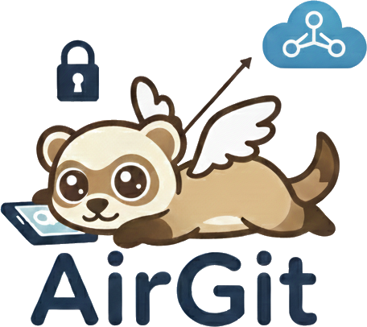

# AirGit



A lightweight web-based GUI for managing Git repositories directly from your browser. Push, pull, create branches, manage remotes, and more - all through an intuitive mobile-friendly interface.

## Features

- 📱 Mobile-optimized interface with single-tap operations
- 📚 Multiple repository management (local filesystem)
- 🌿 Full branch management (list, create, checkout, delete)
- 🏷️ Git tag management (list, create, push)
- 🔄 Git operations (push, pull, status)
- 🌐 Remote management (add, update, remove, select)
- 💾 Repository initialization and creation
- 📊 Ahead/behind commit tracking
- 🎨 UI optimized for mobile with bottom navigation bar
- 📴 PWA support (offline caching, home screen icon)
- 📋 Commit history viewing (past 20 commits)
- 🔧 Systemd service registration and management
- ⚙️ Settings menu for configuration
- 🚀 Standalone Go binary

## Quick Start

### Prerequisites

- Go 1.21+
- Git installed
- Local Git repositories accessible on the file system

### Installation

1. Clone or download the repository
2. Build the binary:

```bash
go build -o airgit
```

3. Set up environment variables (optional) or use command-line flags:

```bash
export AIRGIT_LISTEN_ADDR=0.0.0.0
export AIRGIT_LISTEN_PORT=8080
export AIRGIT_REPO_PATH=$HOME
```

4. Run:

```bash
./airgit
```

5. Open http://localhost:8080 in your browser

### Displaying Help

To see all available options, use:

```bash
./airgit --help
# or
./airgit -h
```

To check the version:

```bash
./airgit --version
# or
./airgit -v
```

## Configuration

Configure via environment variables:

| Variable | Default | Description |
|----------|---------|-------------|
| `AIRGIT_REPO_PATH` | `$HOME` | Base path for repositories (default: user home directory) |
| `AIRGIT_LISTEN_ADDR` | `0.0.0.0` | Server listen address |
| `AIRGIT_LISTEN_PORT` | `8080` | Server listen port |

### Command-Line Flags

Alternatively, use command-line flags (which override environment variables):

| Flag | Description |
|------|-------------|
| `-h`, `--help` | Show help message |
| `-v`, `--version` | Show version information |
| `--repo-path <path>` | Base path for repositories (default: $HOME) |
| `--listen-addr <addr>` | Server listen address (default: 0.0.0.0) |
| `--listen-port <port>` | Server listen port (default: 8080) |
| `-p <port>` | Server listen port (shorthand) |

Example using flags:

```bash
./airgit --repo-path /var/git --listen-port 9000
```

## Multiple Repositories

AirGit supports managing multiple Git repositories on the same filesystem. All repositories must be within the configured `AIRGIT_REPO_PATH` base directory.

### Query Parameters

| Parameter | Description | Example |
|-----------|-------------|---------|
| `path` | Relative path to the Git repository | `projects/my-app` or `/absolute/path` |
| `branch` | Branch name to checkout | `feature/my-feature` |

### Examples

- **Load specific repository**: `http://localhost:8000?path=projects/my-repo`
- **Checkout branch**: `http://localhost:8000?branch=develop`
- **Both**: `http://localhost:8000?path=projects/repo&branch=feature/new`

When you open a URL with these parameters:
1. The server loads the specified repository (if `path` is provided)
2. The branch is automatically checked out (if `branch` is provided and different from current)
3. The UI displays the updated repository path and branch name

## Managing Remotes

### Web UI Remote Management

The AirGit frontend includes a complete UI for managing Git remotes:

1. Click the **"Remotes"** button in the header navigation bar
2. View all configured remotes for the current repository
3. **Add** a new remote with name and URL
4. **Edit** a remote's URL
5. **Remove** a remote from the repository

### REST API - Remote Management

#### Get All Remotes

```bash
GET /api/remotes
```

Response:
```json
{
  "remotes": [
    {
      "name": "origin",
      "url": "https://github.com/user/repo.git"
    },
    {
      "name": "upstream",
      "url": "https://github.com/org/repo.git"
    }
  ]
}
```

#### Add Remote

```bash
POST /api/remote/add
```

Request:
```json
{
  "name": "upstream",
  "url": "https://github.com/user/upstream.git"
}
```

#### Update Remote

```bash
POST /api/remote/update
```

Request:
```json
{
  "name": "origin",
  "url": "https://github.com/newowner/repo.git"
}
```

#### Remove Remote

```bash
POST /api/remote/remove
```

Request:
```json
{
  "name": "origin"
}
```

## API Endpoints

### GET /api/status
Returns current repository status including branch name and ahead/behind counts.

Response:
```json
{
  "branch": "main",
  "repoName": "my-repo",
  "ahead": 2,
  "behind": 1
}
```

### POST /api/push
Executes: `git add .` → `git commit -m "Updated via AirGit"` → `git push [remote]`

Query Parameters:
- `remote` (optional): Remote name to push to (default: `origin`)

Response:
```json
{
  "branch": "main",
  "log": ["$ git add .", "$ git commit...", "..."]
}
```

### POST /api/pull
Executes: `git pull [remote]`

Query Parameters:
- `remote` (optional): Remote name to pull from (default: `origin`)

Response:
```json
{
  "branch": "main",
  "log": ["$ git pull...", "..."]
}
```

### POST /api/checkout
Checkout a branch and return tracking information.

Request Body:
```json
{
  "branch": "feature/my-feature"
}
```

Response:
```json
{
  "branch": "feature/my-feature",
  "ahead": 3,
  "behind": 0,
  "log": ["Switched to branch: feature/my-feature"]
}
```

### GET /api/branches
List all branches in the repository.

Response:
```json
{
  "branches": ["main", "develop", "feature/new"],
  "current": "main"
}
```

### POST /api/branch/create
Create a new branch.

Request Body:
```json
{
  "branch": "feature/new-feature"
}
```

Response:
```json
{
  "branch": "feature/new-feature",
  "log": ["Branch created and checked out"]
}
```

### GET /api/repos
List all repositories in the configured base path.

Response:
```json
{
  "repos": [
    {
      "path": "/home/user/projects/repo1",
      "name": "repo1",
      "branch": "main",
      "isBare": false
    },
    {
      "path": "/home/user/projects/repo2",
      "name": "repo2",
      "branch": "develop",
      "isBare": false
    }
  ]
}
```

### POST /api/load-repo
Load a specific repository.

Request Body:
```json
{
  "path": "projects/my-repo"
}
```

Response:
```json
{
  "path": "projects/my-repo",
  "branch": "main",
  "log": ["Repository loaded"]
}
```

### POST /api/repo/create
Create a new repository.

Request Body:
```json
{
  "path": "projects/new-repo"
}
```

Response:
```json
{
  "path": "projects/new-repo",
  "log": ["Repository created"]
}
```

### POST /api/repo/init
Initialize a repository from an existing directory.

Request Body:
```json
{
  "path": "projects/existing-dir"
}
```

Response:
```json
{
  "path": "projects/existing-dir",
  "log": ["Repository initialized"]
}
```

### GET /api/remotes
Get all remotes in the current repository.

Response:
```json
{
  "remotes": [
    {
      "name": "origin",
      "url": "https://github.com/user/repo.git"
    }
  ]
}
```

### POST /api/remote/add
Add a new remote.

Request Body:
```json
{
  "name": "upstream",
  "url": "https://github.com/org/repo.git"
}
```

### POST /api/remote/update
Update a remote's URL.

Request Body:
```json
{
  "name": "origin",
  "url": "https://github.com/newowner/repo.git"
}
```

### POST /api/remote/remove
Remove a remote.

Request Body:
```json
{
  "name": "upstream"
}
```

### GET /api/tags
List all tags in the repository.

Query Parameters:
- `repoPath` (optional): Relative path to the repository

Response:
```json
{
  "tags": ["v1.0.0", "v1.0.1", "v1.1.0"]
}
```

### POST /api/tag/create
Create a new tag.

Request Body:
```json
{
  "tagName": "v1.0.0",
  "message": "Release version 1.0.0"
}
```

Response:
```json
{
  "commit": "v1.0.0",
  "log": ["$ git tag -a v1.0.0 -m \"Release version 1.0.0\"", "✓ Tag 'v1.0.0' created!"]
}
```

### POST /api/tag/push
Push tag(s) to a remote repository.

Query Parameters:
- `remote` (optional): Remote name to push to (default: `origin`)
- `repoPath` (optional): Relative path to the repository

Request Body:
```json
{
  "tagName": "v1.0.0",
  "all": false
}
```

Or to push all tags:
```json
{
  "all": true
}
```

Response:
```json
{
  "log": ["$ git push origin v1.0.0", "✓ Push successful!"]
}
```

### GET /api/commits
Get commit history for the current repository.

Query Parameters:
- `limit` (optional): Number of commits to return (default: `20`)
- `repoPath` (optional): Relative path to the repository

Response:
```json
{
  "commits": [
    {
      "hash": "abc123def456",
      "author": "John Doe <john@example.com>",
      "date": "2024-12-23 10:30:00",
      "message": "Fix: Update feature"
    },
    {
      "hash": "xyz789uvw123",
      "author": "Jane Smith <jane@example.com>",
      "date": "2024-12-22 15:45:00",
      "message": "Feature: Add new component"
    }
  ]
}
```

## Systemd Service Management

AirGit includes endpoints for registering and managing the application as a systemd user service.

### POST /api/systemd/register
Register AirGit as a systemd user service. This creates a service file at `~/.config/systemd/user/airgit.service` and enables it.

Response:
```json
{
  "success": true,
  "message": "Service registered and enabled"
}
```

### GET /api/systemd/status
Check if AirGit is registered as a systemd service.

Response:
```json
{
  "registered": true,
  "status": "enabled"
}
```

### POST /api/systemd/service-start
Start the AirGit systemd service.

Response:
```json
{
  "success": true,
  "message": "Service started"
}
```

### GET /api/systemd/service-status
Get the current status of the AirGit systemd service.

Response:
```json
{
  "active": true,
  "status": "running"
}
```

## How It Works

1. **Frontend** (HTML5 + Tailwind CSS): Mobile-first UI with bottom navigation bar and intuitive controls
2. **Backend** (Go):
   - Exposes comprehensive HTTP REST API (25+ endpoints)
   - Executes git commands locally
   - Manages multiple repositories in a base directory
   - Supports systemd service registration and management
   - Streams logs and results to frontend
   - Handles errors gracefully
3. **Systemd Integration**: Registers AirGit as a user service for continuous background operation

## Mobile Usage

1. Open AirGit in your phone's browser
2. Use the bottom navigation bar to navigate:
   - **Repos**: Browse and select repositories
   - **Branch**: Manage branches (list, create, checkout)
   - **Remotes**: Manage git remotes
   - **Log**: View commit history (past 20 commits)
   - **Settings**: Access settings and configuration
3. Tap **PUSH** or **PULL** buttons in the center to perform operations
4. Watch the spinner while operations execute
5. View operation logs for details

## Add to Home Screen (iOS/Android)

1. Open AirGit in your browser
2. iOS: Tap Share → Add to Home Screen
3. Android: Tap ⋮ → Install app

The PWA manifest and service worker enable offline caching and home screen installation.

## Architecture

```
Mobile Browser
    ↓ HTTP
AirGit Server (Go)
    ↓ Local File System & Systemd
Local Git Repositories & Systemd User Services
```

### Components

- **Frontend UI**: Bottom navigation bar with Repos, Branch, Remotes, Log, Settings buttons; central Push/Pull operation buttons
- **REST API**: 25+ endpoints for repository, git, and systemd operations
- **Git Executor**: Executes git commands locally on the filesystem
- **Repository Manager**: Handles multiple repositories within base directory
- **Systemd Integration**: Registers and manages AirGit as a systemd user service for background operation

## License

MIT
